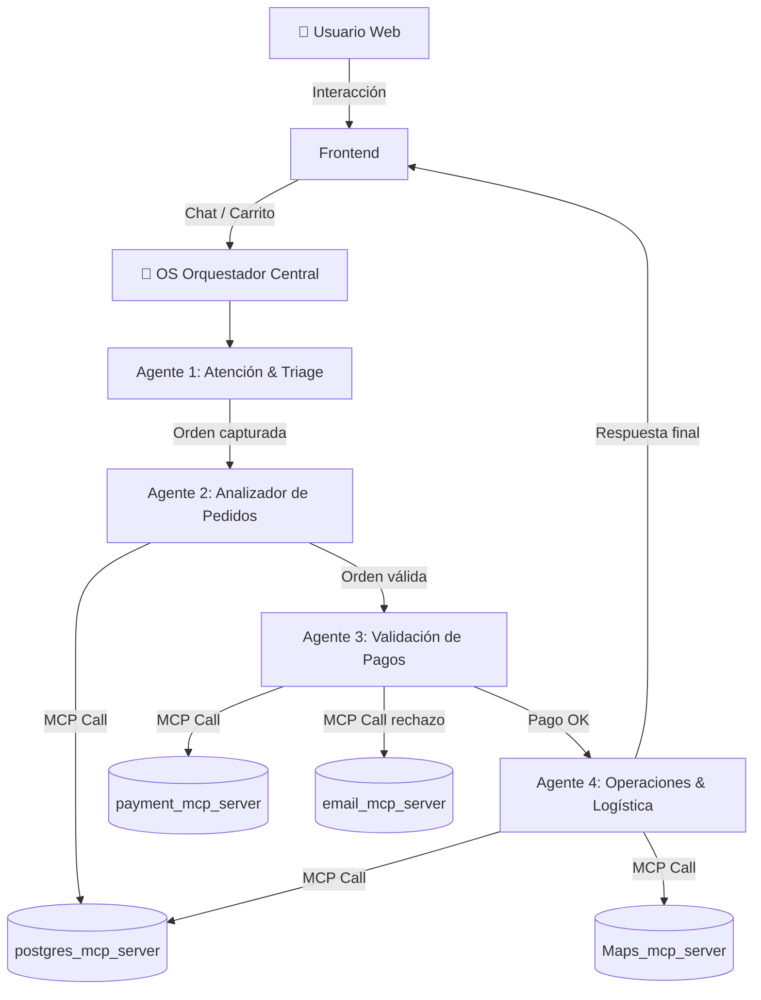

# Automatizacion_Agente
# 🍫 Chocolates Helena — Plataforma Web con Orquestador de Agentes Swarm

## Descripción General

Construcción de una plataforma e-commerce premium para "Chocolates Helena" con un sistema de orquestación de agentes inteligentes en el backend. El orquestador (OS Central) gestiona el ciclo completo de compra a través de 4 agentes especializados que se comunican mediante el Model Context Protocol (MCP) con servidores simulados de Base de Datos, Mapas, Pagos y Email.

---

## Arquitectura del Sistema



---

## Stack Tecnológico

| Capa | Tecnología |
|---|---|
| Frontend | HTML5 + CSS Vanilla + JavaScript ES6+ |
| UI Design | Glassmorphism, Dark Mode Premium, Micro-animaciones |
| Orquestador | JavaScript clase `SwarmOrchestrator` |
| Agentes | Clases JS individuales con `handoff()` |
| MCP Servers | Módulos JS simulados con latencia y estados reales |
| Estado | Objeto global `SessionState` |

---

## Decisiones de Diseño

> [!IMPORTANT]
> Los servidores MCP se **simularán en JavaScript** con latencia realista (500ms–2s), estados de error controlables y respuestas estructuradas. Esto permite demostrar el flujo completo sin dependencias externas reales. El sistema está diseñado para que los módulos MCP sean fácilmente reemplazables por conexiones reales.

> [!NOTE]
> El panel de chat mostrará en tiempo real el log de actividad del enjambre: qué agente está activo, qué herramienta MCP se invocó, y el resultado. Esto hace el sistema completamente trazable/observable desde la interfaz.

---

## Open Questions

> [!IMPORTANT]
> **¿Simular o conectar a servicios reales?**
> El plan asume simulación completa de los MCP servers. Si tienes claves de API reales (Stripe, Google Maps, PostgreSQL), podemos conectar a servicios reales. ¿Confirmas simulación?


---

## Estructura de Archivos

```
Tarea_auto/
├── index.html              # Página principal (catálogo + carrito)
├── checkout.html           # Página de checkout + pasarela de pago
├── success.html            # Pantalla de éxito post-compra
├── admin.html              # Panel de admin (opcional)
│
├── css/
│   ├── main.css            # Sistema de diseño, tokens, layout global
│   ├── catalog.css         # Estilos del catálogo de productos
│   ├── chat.css            # Panel de chat del agente
│   ├── checkout.css        # Formulario y pasarela de pago
│   └── animations.css      # Micro-animaciones y transiciones
│
├── js/
│   ├── orchestrator.js     # 🧠 OS Orquestador Central (SwarmOrchestrator)
│   ├── agents/
│   │   ├── frontAgent.js   # Agente 1: Atención Web & Triage
│   │   ├── orderAgent.js   # Agente 2: Analizador de Pedidos
│   │   ├── paymentAgent.js # Agente 3: Validación de Pagos
│   │   └── logisticsAgent.js # Agente 4: Operaciones & Logística
│   ├── mcp/
│   │   ├── postgresMCP.js  # postgres_mcp_server simulado
│   │   ├── paymentMCP.js   # payment_mcp_server simulado
│   │   ├── mapsMCP.js      # Maps_mcp_server simulado
│   │   └── emailMCP.js     # email_mcp_server simulado
│   ├── state.js            # SessionState global
│   ├── catalog.js          # Datos del catálogo + lógica del carrito
│   └── ui.js               # Controladores de UI, chat renderer
│
└── assets/
    └── images/             # Imágenes generadas con IA
```

---

## Propuestas Detalladas por Componente

### 🎨 Frontend — Diseño Premium

#### [NEW] index.html
- Hero section con video/animación de fondo de chocolates
- Catálogo con cards glassmorphism de cada producto
- Panel de chat flotante (widget) del agente de atención
- Carrito lateral deslizante
- Paleta: Marrones profundos (`#2C1810`, `#4A2C2A`), dorados (`#C9A84C`), crema (`#F5ECD7`), negro premium

#### [NEW] checkout.html
- Formulario de datos del cliente con validación en tiempo real
- Simulador de pasarela de pago (tarjeta interactiva con flip animation)
- Panel de actividad del enjambre en tiempo real (log visual del swarm)
- Progress stepper: Datos → Pago → Confirmación

#### [NEW] success.html
- Animación de confetti/celebración
- Resumen del pedido con datos reales del JSON del Agente 4
- Mapa embebido mostrando la ruta de entrega simulada
- Tiempo estimado de entrega

---

### 🧠 Orquestador Central

#### [NEW] orchestrator.js — `SwarmOrchestrator`
```javascript
// Responsabilidades:
// - Mantener el estado global del flujo
// - Instanciar y coordinar los 4 agentes
// - Registrar todos los eventos en el swarm log
// - Manejar errores MCP y detener flujo si corresponde
// - Emitir eventos al UI para actualización en tiempo real
```

---

### 🤖 Agentes Especializados

#### [NEW] frontAgent.js
- NLP básico para interpretar intenciones del usuario en el chat
- Extracción de: tipo de chocolate, cantidad, ID cliente, dirección
- Handoff a `orderAgent` cuando los datos estén completos
- Mensajes con tono premium y dulce

#### [NEW] orderAgent.js  
- Validación estructural del pedido
- Llama a `postgresMCP.verificar_stock()`
- Llama a `postgresMCP.insertar_pedido()` → estado "Pendiente de Pago"
- Handoff a `paymentAgent` o regresa a `frontAgent` si incompleto

#### [NEW] paymentAgent.js
- Monitorea resultado del formulario de pago (simulado)
- Si rechazado: llama `postgresMCP.eliminar_pedido()` + `emailMCP.enviar_correo_rechazo()`
- Si aprobado: handoff a `logisticsAgent`

#### [NEW] logisticsAgent.js
- Llama `postgresMCP.actualizar_pedido_produccion()` → "Pagado - En Preparación"
- Llama `mapsMCP.calcular_ruta_entrega(dirección)`
- Llama `postgresMCP.actualizar_pedido_entrega(ruta)`
- Genera JSON final estructurado para el frontend

---

### 🔌 Servidores MCP Simulados

#### [NEW] postgresMCP.js
```javascript
// Herramientas disponibles:
// - verificar_stock(tipo, cantidad) → {disponible: bool, stock: int}
// - insertar_pedido(orden) → {pedido_id: uuid, status: "Pendiente de Pago"}
// - eliminar_o_cancelar_pedido(pedido_id) → {success: bool}
// - actualizar_pedido_produccion(pedido_id) → {status: "Pagado - En Preparación"}
// - actualizar_pedido_entrega(pedido_id, ruta) → {success: bool}
// Base de datos en memoria (Map/Array) que persiste durante la sesión
```

#### [NEW] paymentMCP.js
```javascript
// Herramientas disponibles:
// - procesar_pago(token, monto) → {aprobado: bool, codigo: str, mensaje: str}
// Simula 80% aprobación / 20% rechazo para demo
// Tarjeta mágica: 4242 4242 4242 4242 siempre aprueba
// Tarjeta mágica: 4000 0000 0000 0002 siempre rechaza
```

#### [NEW] mapsMCP.js
```javascript
// Herramientas disponibles:
// - calcular_ruta_entrega(direccion) → {lat, lng, tiempo_estimado_min, distancia_km, ruta_puntos}
// Simula geocoding con coordenadas reales de ciudades conocidas
```

#### [NEW] emailMCP.js
```javascript
// Herramientas disponibles:
// - enviar_correo_rechazo(email, pedido_id, motivo) → {enviado: bool, message_id: str}
// Simula el envío (log en consola + confirmación visual)
```

---

## Plan de Ejecución (Orden de construcción)

1. **Fase 1 — Design System** (`main.css`, `animations.css`, tokens de color)
2. **Fase 2 — Estado y MCP** (`state.js`, 4 módulos MCP simulados)
3. **Fase 3 — Orquestador y Agentes** (`orchestrator.js`, 4 agentes)
4. **Fase 4 — Catálogo** (`index.html`, `catalog.css`, `catalog.js`, imágenes generadas)
5. **Fase 5 — Checkout** (`checkout.html`, `checkout.css`, integración con orquestador)
6. **Fase 6 — Éxito** (`success.html`) 
7. **Fase 7 — UI Controller** (`ui.js`, chat panel, swarm log)
8. **Fase 8 — Polish** (animaciones finales, responsivo, pruebas de flujo)

---

## Plan de Verificación

### Tests de Flujo Completos
1. **Flujo Feliz**: Usuario selecciona chocolates → chat → checkout → tarjeta 4242 → éxito con mapa
2. **Flujo Rechazo**: Misma ruta → tarjeta 0002 → email de rechazo → regreso al formulario
3. **Flujo Incompleto**: Pedido sin dirección → Agente 1 solicita información faltante
4. **Error MCP**: Simular timeout de BD → flujo se detiene y reporta error

### Verificación Visual con Browser
- Abrir la app en el navegador y ejecutar cada flujo manualmente
- Verificar el swarm log en tiempo real durante checkout
- Confirmar que la pantalla de éxito muestra datos reales del JSON del Agente 4
